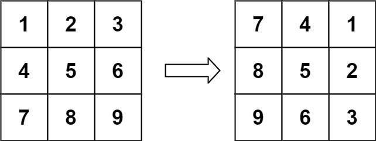

## You are given an n x n 2D matrix representing an image, rotate the image by 90 degrees (clockwise).

- You have to rotate the image in-place, which means you have to modify the input 2D matrix directly. DO NOT allocate another 2D matrix and do the rotation.



---
_Example 1_
```
Input: matrix = [[1,2,3],[4,5,6],[7,8,9]]
Output: [[7,4,1],[8,5,2],[9,6,3]]
```

i want cicle all elements in matrix and take the first element 3 by 3 and push
in a new array reversed 

```python
matrix = [[1,2,3],[4,5,6],[7,8,9]]
def rotate(matrix):
    n = len(matrix)
    for i in range(n // 2 + n % 2):
        for j in range(n // 2):
            matrix[ n - 1 - j][i] = matrix[n - 1 - i][n - j - 1]
            matrix[n - 1 - i][n - j - 1] = matrix[j][n - 1 -i]
    return matrix
```
